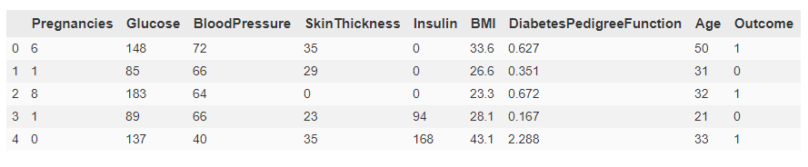
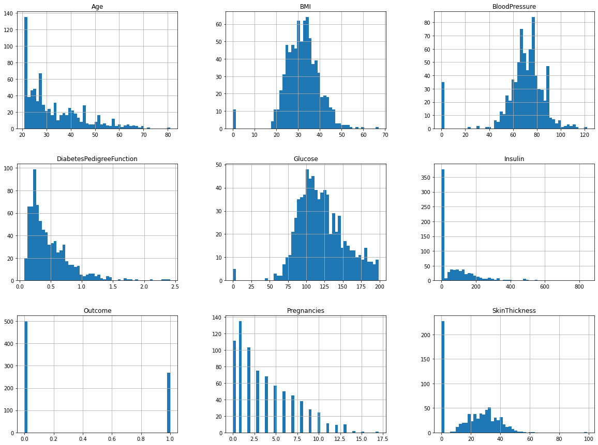
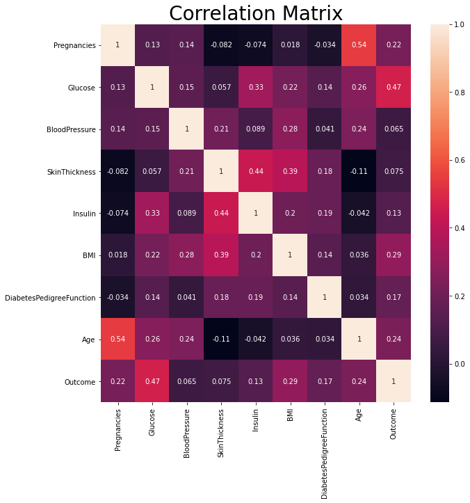
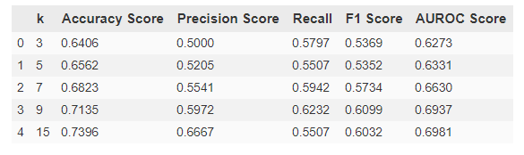
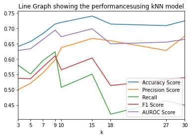
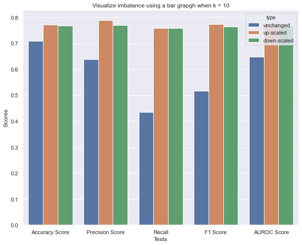

# DiabetesPrediction

This repository consists of an .ipynb file that does comparative 
analysis of various machine learning algorithms on the given 
dataset for diabetes prediction. The dataset used is diabetes.csv

The dataset has the following features :

## Dataset variance 

We also do a systematic analysis of the given data and the 
distributions are visualized in the following image :

## Dataset Correlation

We also compare how different features are correlated with each other, 
which in turn can affect the outcome. The correlation matrix is 
visualized below :

## Performance of different k in kNN model

## Addressing class imbalance

We also take a note that our classes are imbalanced as shown in the figure :

More experiments and evaluations are given in the .ipynb notebook.